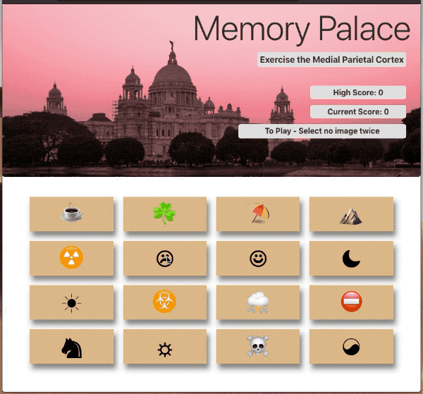
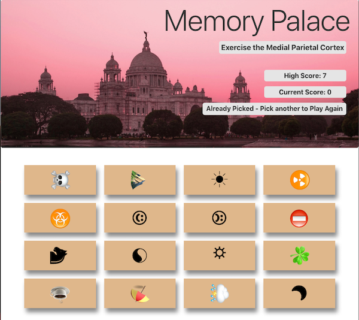

# Memory Palace 

## React.js memory game

## Description

This React.js web page is a simply memory game where the object is to select all 16 images without selecting any twice.  After each selection the board shuffles randomly and images also randomly rotate.   Current Score is tracked and High Score is display and upated as appropriate.

- #### Front-End Technology

  - React.js, HTML, CSS, JavaScript (ES6)

## Details:

#### Github project :    <a href="https://github.com/mylescarey2019/MemoryPalace">Memory Palace Repository</a>

#### Deployed GitHub Pages link:  <a href="https://mylescarey2019.github.io/MemoryPalace/">Memory Palace</a>

#### Design Detail - React.js methodology

- components rendered include Header, Scores, Message and Game Tiles
- Score and Game Tile component resused multiple times on page
- state used for rendering current and high scores
- state used for populating image the Game Tiles and is updated when randomized each move

#### Demo walkthru GIF : 

- Use Cases seen in demo below
  - [x] selecting same symbol twice - loss
  - [x] new high score
  - [x] randomized shuffle and rotation

#### Screen Captures:

home page

## Getting Started

### Dependencies

- none - 

### Installing

- none necessary - use link to page deployed on GitHub pages

### Executing program

- click an image and repeat
- if image clicked twice current score will change to 0 - click image to start new game

## Authors

Myles Carey 
mylescarey2019@gmail.com 

## Version History

- 1.0 - Initial Release
- dev branch

## License

## Acknowledgments

Thanks to beta testers - my 15yo & 17yo daughters and wife 

